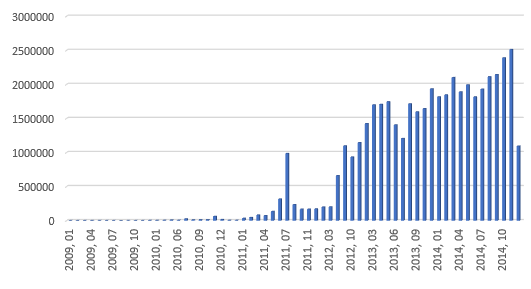
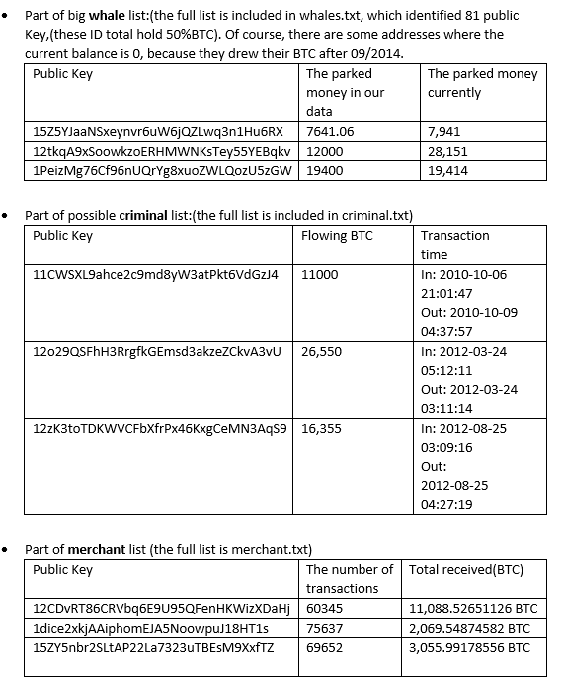

# bitcoin
A bitcoin data analysis experiments

1.Create a bar chart showing the number of transactions for each month that occurred between the beginning and end of the data set. and analyze general trends in Bitcoin usage

2.Obtain the top 10 donors over the whole dataset for the Wikileaks bitcoin address: {1HB5XMLmzFVj8ALj6mfBsbifRoD4miY36v}.

3.Explore how much of BTC is used as a means of exchange (small transactions) as opposed to long term investment (Parked coins or large purchases)

4.Identify different types of users e.g."whales" (volume trader/"hodler" of BTC), merchant accepting BTCs, or possibly criminal organizations.

